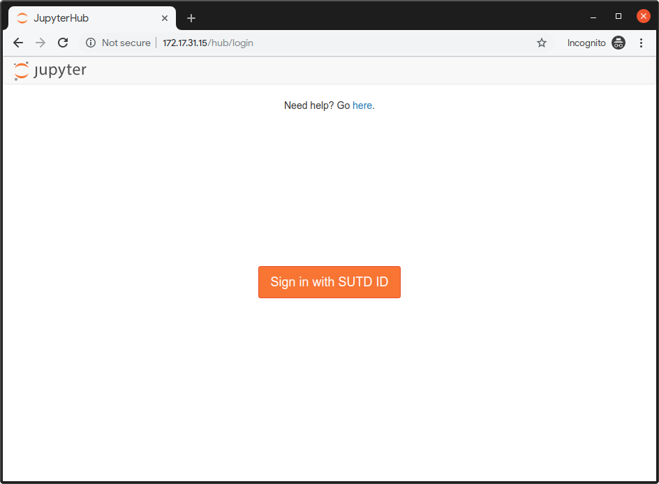
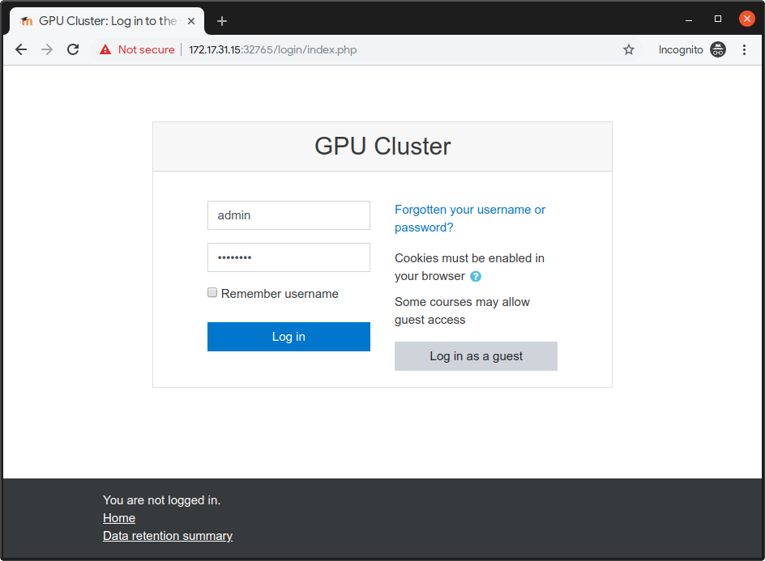
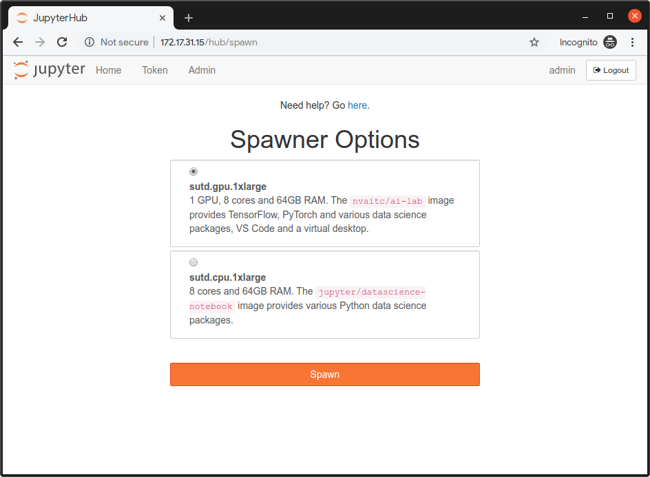
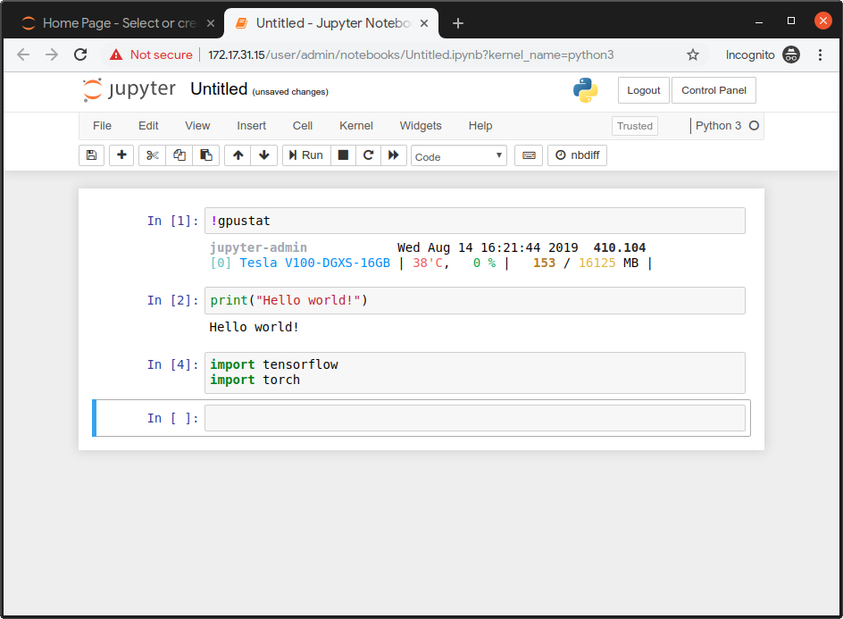
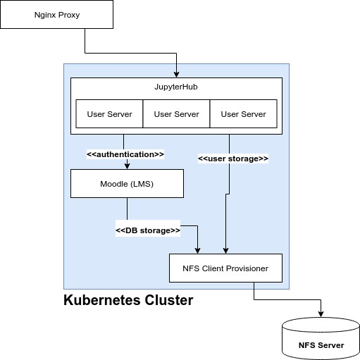

# On-prem JupyterHub Setup

This is a setup guide to configure an On-prem JupyterHub cluster running on Kubernetes, with login and user management. It assumes you already have the physical cluster networking configured. 

 

 

## System Architecture



* [Kubernetes](https://kubernetes.io/) provides the underlying infrastructure
* [Moodle](https://moodle.org/) provides user management (geared towards schools) and OAuth authentication service
* [JupyterHub](https://jupyter.org/hub) provides a multi-user environment for Jupyter servers
* Dedicated NFS Server provides pods with persistent storage

This design assumes the Kubernetes cluster's physical network is isolated, with a proxy node used to provide a single entrypoint into the cluster. [Nginx](https://nginx.org/en/) is used on this proxy node to provide the following proxies so that external users can access the cluster via `proxy-ip`, the external IP address of the proxy node. 

* `proxy-ip:80` -> JupyterHub
* `proxy-ip:5050` -> Moodle

This is important as this will be part of the OAuth configuration (e.g. callback URL).

## Provisioning a new node

This section needs to be run on **every** new node prior to setting up the Kubernetes cluster.

1. Install Ubuntu 18.04 LTS
2. Run commands below:

```shell
sudo su root
# as root user
apt-get update && apt-get install -y curl
# baller one liner move
export NODE_SETUP_SCRIPT=https://raw.githubusercontent.com/NVAITC/onprem-gpu-cluster-setup/master/setup_node.sh
curl $NODE_SETUP_SCRIPT | bash
# system will automatically reboot after done
```

**Post Install for GPU Nodes**

After system reboot, perform the follow step to set the default container runtime to the NVIDIA Container Runtime and allow your default user to use Docker without `sudo`:

```shell
sudo usermod -aG docker $USER
sudo nano /etc/docker/daemon.json
```

Modify your file to look something like this:

```json
{
    "default-runtime": "nvidia",
    "runtimes": {
        "nvidia": {
            "path": "nvidia-container-runtime",
            "runtimeArgs": []
        }
    }
}
```

Do `sudo pkill -SIGHUP dockerd` to restart the Docker daemon.

## Deploy Kubernetes Cluster

This section will deploy Kubernetes on the master node, and then provide you with the command to run on each worker node in order to join the Kubernetes cluster.

Reference: https://kubernetes.io/docs/setup/production-environment/tools/kubeadm/create-cluster-kubeadm/

**Part 1: Master Node**

```shell
sudo kubeadm init --pod-network-cidr=10.244.0.0/16

mkdir -p $HOME/.kube
sudo cp -i /etc/kubernetes/admin.conf $HOME/.kube/config
sudo chown $(id -u):$(id -g) $HOME/.kube/config

# you might want to check for an updated Flannel:
# https://kubernetes.io/docs/setup/production-environment/tools/kubeadm/create-cluster-kubeadm/#pod-network

kubectl apply -f https://raw.githubusercontent.com/coreos/flannel/2140ac876ef134e0ed5af15c65e414cf26827915/Documentation/kube-flannel.yml

# allow pods to schedule on master
kubectl taint nodes --all node-role.kubernetes.io/master-

# check pods to make sure all running
kubectl get pods --all-namespaces
```

**Optional: deploy Kubernetes Dashboard**

```shell
kubectl apply -f https://raw.githubusercontent.com/kubernetes/dashboard/v2.0.0-beta8/aio/deploy/recommended.yaml
```

For setup instructions, see: https://github.com/kubernetes/dashboard/wiki/Creating-sample-user


**Part 2: Other Nodes**

Run the join command (**included in output of `kubeadm init`** in the previous section).

Run `kubectl get nodes` as a sanity check. Every node should be in `Ready` state within 60s.

**Post Install**

Deploy NVIDIA device plugin:

```shell
kubectl create -f https://raw.githubusercontent.com/NVIDIA/k8s-device-plugin/1.0.0-beta4/nvidia-device-plugin.yml
```

You can check for a newer version of the plugin [here](https://github.com/NVIDIA/k8s-device-plugin#enabling-gpu-support-in-kubernetes).

Within 60s, the GPUs should be visible to Kubernetes. You can run the follow command to check:

```shell
kubectl get nodes -o=custom-columns=NAME:.metadata.name,GPUs:.status.capacity.'nvidia\.com/gpu'
```

## Install and Initialize Helm

Before following the instructions, you can check for the latest version of Helm [here](https://github.com/helm/helm/releases). The instructions below work for Helm 3.x and not 2.x!

```shell
wget https://get.helm.sh/helm-v3.0.2-linux-amd64.tar.gz
tar -xvf helm-v3.0.2-linux-amd64.tar.gz linux-amd64/
chmod +x linux-amd64/helm
sudo mv linux-amd64/helm /usr/local/bin/helm

# initialize Helm

helm repo add stable https://kubernetes-charts.storage.googleapis.com/
helm repo update
```

## Deploy Storage Backend

In this section, you will deploy a NFS server if you don't already have one, and create the Kubernetes `nfs-client-provisoner` in order to access the NFS server from Kubernetes. This step is very important as any pods that requires persistent state (e.g. databases, user files etc.) will need this storage backend.

### Setting up an NFS Server

You will need an NFS storage server. This will **not** be managed by Kubernetes, but can run on one of your Kubernetes nodes. 

If you are using a hard-disk array, you should use RAID 5, which gives you reasonable redundancy, good read speeds but relatively lousier write speeds. We prioritise read speeds as these could be a bottleneck during training. If using a hardware RAID card, be sure to enable the controller cache.

This is a simple procedure, you can follow guides online such as [this one](https://vitux.com/install-nfs-server-and-client-on-ubuntu/). Take note of your NFS server's IP address and **system path** to your NFS share, e.g. `/mnt/RAID/`. However, there are a few configuration details you need to take note of:

```
/mnt/RAID/    10.12.0.0/16(rw,async,no_subtree_check,no_root_squash)
```

* Whitelisted IP address should be that of your physical nodes
* Add `async` for better performance at the cost of possible data corruption if the server reboots while still holding unwritten data in its caches
* `no_root_squash` is (unfortunately) needed since some containers will otherwise not be able to write their attached volumes since they run as `root`

### Install `nfs-client-provisioner`

This will create a Kubernetes [`StorageClass`](https://kubernetes.io/docs/concepts/storage/storage-classes/) for Pods to use to create persistent volumes (via [`PersistentVolume`](https://kubernetes.io/docs/concepts/storage/persistent-volumes/)).

**More Info**

* https://github.com/helm/charts/tree/master/stable/nfs-client-provisioner
* https://www.kubeflow.org/docs/use-cases/kubeflow-on-multinode-cluster/

```shell
# replace with NFS Server IP Address
export NFS_IP=192.168.X.X
export NFS_PATH=/mnt/RAID

helm install \
  --set nfs.server=$NFS_IP \
  --set nfs.path=$NFS_PATH \
  --set storageClass.name=nfs \
  --set storageClass.defaultClass=true \
  stable/nfs-client-provisioner
```

**Sanity Check**

```shell
kubectl get storageclass -n kubeflow
```

## Deploy Moodle

**Part 1: Install Moodle**

Moodle is a LMS (learning management system). We are using Moodle as the authentication service because Moodle is a mature platform that provides bulk user management features suitable for educational institutions. We will be deploying Moodle on Kubernetes with a Helm chart with default settings. 

For more information on the helm chart, see [helm/charts/tree/master/stable/moodle](https://github.com/helm/charts/tree/master/stable/moodle).

```shell
export MOODLE_ADMIN=admin
export MOODLE_PASSWORD=password
helm install \
  --set moodleUsername=$MOODLE_ADMIN,moodlePassword=$MOODLE_PASSWORD,metrics.enabled=true,resources.requests.cpu=2,resources.requests.memory=2Gi,mariadb.requests.resources.cpu=2,mariadb.requests.resources.memory=2Gi moodle stable/moodle \
  moodle stable/moodle
```

After a while, Moodle will start up. Run `kubectl get pods` to check.

**Part 2: Install OAuth Plugin**

Reference: https://github.com/jupyterhub/oauthenticator/blob/master/docs/source/getting-started.rst#moodle-setup

Install the Moodle OAuth plugin:

1. Download: https://github.com/projectestac/moodle-local_oauth/archive/master.zip
2. Install by uploading the zip file at `Site administration > Plugins > Install plugins`
3. Head over to `Site administration > Server > OAuth provider settings > Add new client` 
4. Set callback URL to `http://proxy-ip/hub/oauth_callback`


## JupyterHub Setup

Reference: [zero-to-jupyterhub](https://zero-to-jupyterhub.readthedocs.io/en/latest/)

Create a config file `jh-config.yaml`. Below is a template you can follow:

```yaml
hub:
  extraEnv:
    OAUTH2_AUTHORIZE_URL: http://proxy-ip:5050/local/oauth/login.php?client_id=jupyterhub&response_type=code
  extraConfig:
        announcementConfig: |
          c.JupyterHub.template_vars = {"announcement": "New here? <a href='#'>Get help here</a>"}
proxy:
  secretToken: # generate this with `openssl rand -hex 32`
auth:
  type: custom
  custom:
    className: oauthenticator.generic.GenericOAuthenticator
    config:
      login_service: "SUTD ID"
      client_id: "jupyterhub"
      client_secret: "secret-key"
      oauth_callback_url: "http://proxy-ip/hub/oauth_callback"
      token_url: "http://proxy-ip:5050/local/oauth/token.php"
      userdata_url: "http://proxy-ip:5050/local/oauth/user_info.php"
      userdata_method: "GET"
      extra_params: {"scope":"user_info","client_id":"jupyterhub","client_secret":"secret-key"}
  admin:
    users:
      - gpuadmin
    access: true
singleuser:
  profileList:
    - display_name: "sutd.gpu.1xlarge"
      description: "1 GPU, 4 cores and 32GB RAM. The <code>nvaitc/ai-lab</code> image provides TensorFlow, PyTorch and various data science packages, VS Code and a virtual desktop."
      kubespawner_override:
        image: nvaitc/ai-lab:20.01-vnc
        extra_resource_limits:
          nvidia.com/gpu: "1"
      default: true
    - display_name: "sutd.cpu.1xlarge"
      description: "4 cores and 32GB RAM. The <code>jupyter/datascience-notebook</code> image provides various Python data science packages."
      kubespawner_override:
        image: jupyter/datascience-notebook:latest
  storage:
    extraVolumes:
      - name: shm-volume
        emptyDir:
          medium: Memory
    extraVolumeMounts:
      - name: shm-volume
        mountPath: /dev/shm
  extraEnv:
    JUPYTER_ENABLE_LAB: "yes"
  memory:
    limit: 32G
    guarantee: 8G
  cpu:
    limit: 6
    guarantee: 2
  networkPolicy:
    enabled: true
    egress:
      - ports:
          - port: 53
            protocol: UDP
      - ports:
          - port: 80
            protocol: TCP
      - ports:
          - port: 443
            protocol: TCP
cull:
  enabled: true
  timeout: 7200
  every: 360
```

You'll need Helm (already configured in the previous step). Check for the latest release of the JupyterHub helm chart (version of Helm chart is not version of JupyterHub!) at this [link](https://jupyterhub.github.io/helm-chart/). Replace the env variable `RELEASE` with the version of the Helm chart that you desire.

```shell
helm repo add jupyterhub https://jupyterhub.github.io/helm-chart/
helm repo update

export RELEASE=0.9.0-beta.3

helm upgrade --install jhub jupyterhub/jupyterhub \
  --version=$RELEASE \
  --values jh-config.yaml
```

After the Helm chart is applied, you will see some output.

Use `kubectl get pods` to check and see if all the pods are running:

```
NAME                                                    READY   STATUS    RESTARTS   AGE
hub-7c57d4c987-tpzd7                                    1/1     Running   0          39s
moodle-85db564ccb-6mwrb                                 2/2     Running   0          4m44s
moodle-mariadb-0                                        1/1     Running   0          4m43s
proxy-5f7c857cd9-djrrx                                  1/1     Running   0          39s
wistful-jackal-nfs-client-provisioner-8c6b99c9f-24cdr   1/1     Running   0          5m46s
```

## Expose Ports

We will expose the relevant services via `NodePort` services since `LoadBalancer` services are geared towards managed cloud services. 

Check the services running with `kubectl get services`:

```
NAME             TYPE           CLUSTER-IP       EXTERNAL-IP   PORT(S)                      AGE
hub              ClusterIP      10.104.13.35     <none>        8081/TCP                     90s
kubernetes       ClusterIP      10.96.0.1        <none>        443/TCP                      20m
moodle           LoadBalancer   10.109.72.235    <pending>     80:31614/TCP,443:30718/TCP   5m35s
moodle-mariadb   ClusterIP      10.105.174.183   <none>        3306/TCP                     5m35s
proxy-api        ClusterIP      10.102.6.196     <none>        8001/TCP                     90s
proxy-public     LoadBalancer   10.110.167.173   <pending>     80:31895/TCP,443:30922/TCP   90s
```

Expose `moodle` and `proxy-public`.

```shell
kubectl expose service/moodle --type=NodePort --name=moodle-service
kubectl expose service/proxy-public --type=NodePort --name=jh-service
```

Run `kubectl get services | grep NodePort` again to see which are the exposed NodePorts:

```
jh-service       NodePort       10.106.50.222    <none>        80:31626/TCP,443:30301/TCP   38s
moodle-service   NodePort       10.107.36.166    <none>        80:30670/TCP,443:32038/TCP   41s
```

In this case, JupyterHub is exposed at port `31626` and Moodle at port `30670`.

## Set up Nginx Proxy

Now, let's set up the Nginx proxy. 

```shell
sudo apt install nginx -y
```

**Modify Nginx config**

```shell
sudo nano /etc/nginx/sites-enabled/default
```

Modify the file to look like this. In particular, modify the `proxy_pass` fields accordingly.

```
server {
        listen 80 default_server;
        listen [::]:80 default_server;

        server_name _;

        location / {
                proxy_pass http://localhost:31895;
                proxy_set_header X-Real-IP $remote_addr;
                proxy_set_header Host $http_host;
                proxy_http_version 1.1;
                proxy_set_header Upgrade $http_upgrade;
                proxy_set_header Connection "upgrade";
        }
}

server {
        listen 5050 default_server;
        listen [::]:5050 default_server;

        server_name moodle;

        location / {
                proxy_pass http://localhost:30670;
                proxy_set_header X-Real-IP $remote_addr;
                proxy_set_header Host $http_host;
                proxy_http_version 1.1;
                proxy_set_header Upgrade $http_upgrade;
                proxy_set_header Connection "upgrade";
        }
}
```

This Nginx configuration will create the following proxy:

* `proxy-ip:80` -> JupyterHub
* `proxy-ip:5050` -> Moodle

## Finishing Steps

* Configure Moodle users
* Monitoring

